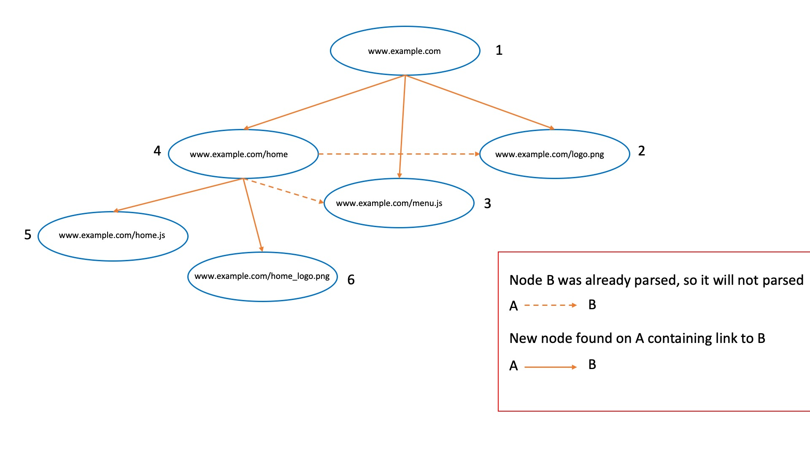

# Dynamic-dirb

Dynamic-dirb written in go.

## Works only on useful OS (Linux and MacOS)

## How it works

Basically it uses *Breadth First Search* algorithm ([BFS](https://commons.wikimedia.org/wiki/File:Animated_BFS.gif)) to discover new nodes. When a new node is discovered, it is parsed to discover new links and subpaths.

[Additional regex can be easily implemented in order to improve the program capability to find new nodes](#adding-new-custom-rules).

### Example



## Basic compiling

go build ddirb.go

## Cross compiling

Raspberry: ```env GOOS=linux GOARCH=arm go build -o ddirb_linux ./dynamic-dirb.go```

Kali: ```env GOOS=linux GOARCH=amd64 go build -o ddirb_linux ./dynamic-dirb.go```

## Usage

```
Usage of ./dynamic-dirb:
-type:			Set -type dynamic/static/resumeDynamic

dynamic Usage:
	-url:		Target url in http/https format (http://example.com)
	-output:	Output file (default /tmp/ddirb-output)
	-threads:	Number of threads to use
	-delay:		Delay in seconds between each thread
	-debug:		Flag to print in verbose mode
	-graph:		Flag to save the graph in .dot language
	-headers:	Set headers (es. Header1:value1;value2,Header2:value1)
[NOT IMPLEMENTED YET] static Usage:
	-url:		Target url in http/https format (http://example.com)
	-output:	Output file (default /tmp/ddirb-output)
	-threads:	Number of threads to use
	-delay:		Delay in seconds between each thread
	-debug:		Flag to print in verbose mode
	-headers:	Set headers (es. Header1:value1;value2,Header2:value1)
resumeDynamic Usage:
	-restoreFile:	Input file (default /tmp/ddirb-output.restore)
	-output:	Output file (default /tmp/ddirb-output)
	-threads:	Number of threads to use
	-delay:		Delay in seconds between each thread
	-debug:		Flag to print in verbose mode
	-graph:		Flag to save the graph in .dot language
	-headers:	Set headers (es. Header1:value1;value2,Header2:value1)
```

# Example

#### "dynamic" usage

```./dynamic-dirb -type dynamic -url https://example.com -graph -output ~/Desktop/ddirbOut```

Generated output:
1. If scan has finished &rarr; ```cat ~/Desktop/ddirbOut; cat ~/Desktop.dot```

2. If scan has not finished &rarr; ```cat ~/Desktop/ddirbOut; cat ~/Desktop/ddirbOut.dot; cat ~/Desktop/ddirbOut.restore```

#### "resumeDynamic" usage
Resume dynamic mode can be used **only** when the dynamic scan was interrupted using ```ctrl + c```. Specifically, the ```.restore``` file is generated automaticcaly if the dynamic scan was not completed

```./dynamic-dirb -type resumeDynamic -restoreFile ~/Desktop/ddirbOut.restore -output ~/Desktop/ddirbOutRestored -graph```

Generated output:
1. If scan has finished &rarr; ```cat ~/Desktop/ddirbOutRestored; cat ~/ddirbOutRestored.dot```

2. If scan has not finished &rarr; ```cat ~/Desktop/ddirbOutRestored; cat ~/Desktop/ddirbOutRestored.dot; cat ~/Desktop/ddirbOutRestored.restore```


## Adding new custom rules

In order to add new custom rules you shuold edit ```/internal/dynamic/parser.go```  file.

#### Example

Adding new function

```
func getMyCustomUrl(MyChannel chan<- []string, response http_mng.ResponseInfo) {
	var body = response.ResponseBodyString
	var return_matched []string
	var regex = regexp.MustCompile(`PUT REGEX HERE`)
	var result = regex.FindAllStringSubmatch(body, -1)
	for _, s := range result {
		for j := 1; j < len(s); j++ {
			return_matched = append(return_matched, s[j])
			service.GetParameters().PrintDebug("[+] Regex getting my custom url: " + s[j])
		}
	}
	MyChannel <- return_matched
}
```

Adding new thread call (in GetFinalUrls function)

```
MyCustomChannel := make(chan []string, 1)
go getMyCustomUrl(MyCustomChannel, response)
discoveredCustomUrl := <-MyCustomChannel
discoveredUrl = append(discoveredUrl, discoveredCustomUrl...)
```


